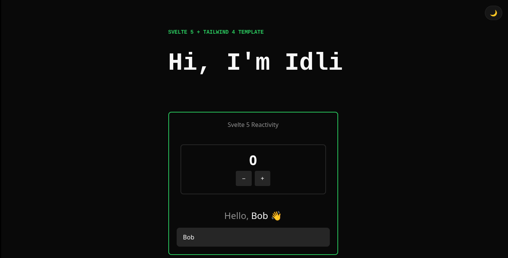
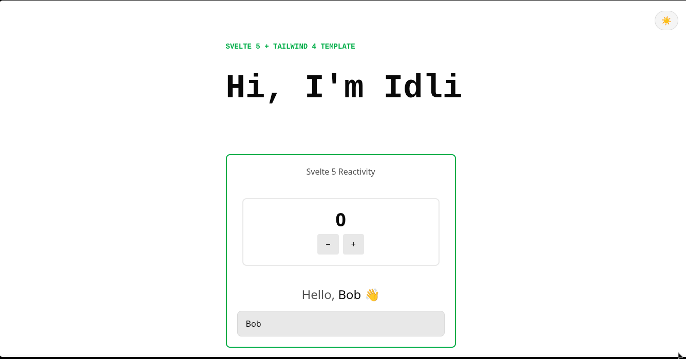

# Svelte 5 Template

A lightweight **Svelte 5 + Tailwind CSS v4** starter template powered by Vite.

I made this because I got tired of running `npm create vite@latest`, installing and configuring Tailwind, setting up my preferred theme, and repeating the same initial work every time I started a Svelte project.

This template is meant to be simple:

**Clone > install > start building.**

## Screenshots

| Dark Theme                             | Light Theme                              |
| -------------------------------------- | ---------------------------------------- |
|  |  |

## Tech Stack

- [Svelte 5](https://svelte.dev/)
- [Vite](https://vite.dev/)
- [Tailwind CSS v4](https://tailwindcss.com/)
- OKLCH color variables

## Features

- **Svelte 5 runes** with `$state`
- **Tailwind CSS v4**
- Dark and light themes
- OKLCH-based color system

## Getting Started

### Requirements

You need:

- Node.js
- npm
- Git

You can check whether they are installed with:

```bash
node --version
npm --version
git --version
```

### 1. Clone the repository

```bash
git clone https://github.com/idli69/svelte-template.git
```

Then enter the project directory:

```bash
cd svelte-template
```

### 2. Install dependencies

```bash
npm install
```

### 3. Start the development server

```bash
npm run dev
```

Vite will show a local URL in the terminal, usually:

```text
http://localhost:5173/
```

Open that URL in your browser(don't send it to yo friends though.).

> !NOTE
> Rest if you know how to use VITE you are good.

### 4. Start building

The main application is located in:

```text
src/App.svelte
```

Components can be added to:

```text
src/lib/
```

## Theme System

The template uses CSS custom properties for its colors rather than hard-coding colors throughout the application.

The main theme tokens include:

- Background
- Surface
- Foreground
- Muted
- Muted foreground
- Primary
- Primary foreground
- Border

The colors are defined using **OKLCH** (a modern color system), making it easier to maintain a consistent color system.
This allows the same component styles to work across the light and dark themes.

## Example Components

The template includes a small counter component demonstrating Svelte 5's rune-based reactivity and also a `input:bind:` feature of Svelte.
These examples are intentionally small so they can either be kept as references or removed when starting a new project.
